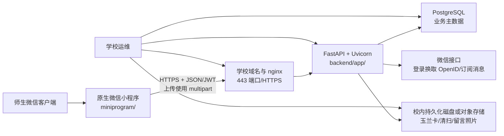

# 笃学书院空间预约系统技术交接事宜

| 文档项 | 内容 |
|---|---|
| 项目名称 | 笃学书院空间预约系统 v2 |
| 交付形态 | 原生微信小程序 + FastAPI API + PostgreSQL + nginx/Docker 部署模板 |
| 当前阶段 | `v0.x` 校内试点候选，尚未宣称达到正式生产标准 |
| 代码仓库 | `syann2788-arch/DUT-duxue-space-booking` |
| 当前评审入口 | [GitHub PR #27](https://github.com/syann2788-arch/DUT-duxue-space-booking/pull/27)；最终交付以合并后的 `main` 或双方确认的 Release Tag 为准 |
| 文档日期 | 2026-08-09 |
| 信息分级 | 文档不包含 AppSecret、数据库密码、JWT 密钥、真实学生名册或照片 |

## 1. 文档目的

本文供笃学书院业务负责人、学校信息化部门、微信小程序管理员和后续开发维护人员共同使用，目标是明确：

1. 当前系统实际采用的技术链路与各目录边界；
2. 学校需提供的基础设施、账号、域名和安全条件；
3. 从代码接收、部署、微信平台配置到上线验收的实施步骤；
4. 上线后的监控、备份、恢复、升级和责任分工；
5. 当前尚未完成的生产门槛，防止将本地演示环境直接作为正式系统使用。

## 2. 交付结论与推荐部署方案

### 2.1 当前正式运行链路



正式 v2 **不使用微信云开发作为主后端**。`cloudfunctions/` 是第一版历史参考代码，`project.config.json` 已设置 `cloud: false`；正式数据只应写入 FastAPI 所连接的 PostgreSQL。

### 2.2 推荐托管位置

优先推荐部署在学校信息化部门管理的 Linux 虚拟机、校内私有云或学校统一容器平台，原因是系统涉及学号、姓名、联系方式、预约记录和照片，学校可统一管理网络边界、账号权限、日志、备份和数据保留。

不能预先假设学校一定提供服务器。书院应先向学校网络与信息化部门提交本文件，并确认以下选项之一：

| 方案 | 适用条件 | 责任边界 |
|---|---|---|
| 学校虚拟机/私有云（优先） | 学校可提供 Linux、域名、HTTPS、PostgreSQL 或容器服务 | 学校负责基础设施与运维，项目方协助部署和验收 |
| 学校已有应用/容器平台 | 学校有 Kubernetes、Docker 平台、统一网关或数据库服务 | 按学校平台规范改造 Compose、日志、密钥和健康检查 |
| 经学校批准的公有云服务器 | 校内暂时无资源且学校允许合规上云 | 学校明确采购主体、备案、安全、数据位置和运维责任 |
| 微信云开发/CloudBase | 学校决定改为腾讯托管后端 | 需要重新评估并改造当前 FastAPI、PostgreSQL、媒体和运维链路，不是“直接打开开关” |

## 3. 交付物与代码边界

| 路径/交付物 | 定位 | 是否进入正式链路 |
|---|---|---|
| `miniprogram/` | 原生微信小程序正式前端 | 是 |
| `backend/app/` | FastAPI、认证、业务规则、事务和通知 | 是 |
| `backend/tests/`、`backend/guards/` | 后端回归和架构守护 | 是，属于质量门禁 |
| `.github/workflows/ci.yml` | 后端、小程序、供应链和容器 CI | 是 |
| `Dockerfile`、`docker-compose.yml` | API 与 PostgreSQL 单机容器部署基线 | 是，需由学校按环境复核 |
| `deploy/nginx.conf` | HTTPS 反向代理模板 | 是，域名与证书为占位值 |
| `docs/` | 架构、需求、微信联调、整改和交接材料 | 是 |
| `frontend/` | 历史 uni-app/H5 参考实现 | 否 |
| `cloudfunctions/` | 第一版云函数参考 | 否；不得误部署为 v2 后端 |
| `backend/shuyuan.db` | 本地 SQLite 演示数据 | 否；被 Git 忽略，不得作为生产数据库交接 |
| `backend/uploads/`、真实人员 CSV | 本地照片和个人数据 | 否；不得上传公共 GitHub |

交接时应提供仓库访问权限、确认后的 Commit SHA/Release Tag 和 CI 结果，不以压缩包中的不明版本替代 Git 版本基线。

## 4. 参与方与责任分工

| 参与方 | 主要责任 |
|---|---|
| 笃学书院业务负责人 | 确认预约规则、开放时间、房间、角色名单、隐私用途、照片保留期和最终验收 |
| 学校信息化/运维部门 | 提供服务器、网络、DNS、HTTPS、数据库、密钥托管、备份、监控、漏洞修复和故障响应 |
| 微信小程序管理员 | 管理正式 AppID、开发者/体验成员、AppSecret、合法域名、隐私指引、订阅模板、审核和发布 |
| 项目开发维护人员 | 交付代码、构建产物、配置说明、部署协助、问题定位和经审批的软件更新 |
| 数据/安全责任人 | 审批学生名册和照片的采集范围、访问权限、保存期限、删除流程和安全事件处置 |

任何真实密钥均应通过学校密码库或受控渠道交接，不应出现在 Git、聊天记录、截图、演示视频或本文档中。

## 5. 学校需确认和提供的信息

### 5.1 基础设施问卷

- [ ] 是否可提供长期运行的 Linux 虚拟机、私有云实例或容器命名空间？
- [ ] 是否支持 Docker Engine 与 Docker Compose，或有等价容器平台？
- [ ] 是否提供 PostgreSQL；如提供，版本、地址、数据库名、最小权限账号和连接限制是什么？
- [ ] 是否可分配正式域名，例如 `space-api.<school-domain>`？
- [ ] HTTPS 证书由谁申请、部署和续期？
- [ ] 外部微信客户端能否通过 443 端口访问该域名？服务器能否访问微信服务端接口？
- [ ] 是否有统一日志、监控、告警、备份和密码管理平台？
- [ ] 照片应保存到校内磁盘还是对象存储？允许保存多久？
- [ ] 是否有学校统一身份认证（SSO）或可授权导入的学生/教职工名册？
- [ ] 系统故障、安全事件和数据请求分别由谁响应？

### 5.2 微信平台信息

- [ ] 经学校/书院认证并实际拥有的小程序 AppID；
- [ ] 小程序管理员和被授权的开发者、体验成员；
- [ ] 仅由服务器保管的 AppSecret；
- [ ] 提交、审核、提醒、资格变更等订阅消息模板 ID 和字段顺序；
- [ ] request、uploadFile、downloadFile 合法域名配置权限；
- [ ] 隐私保护指引、用户服务条款、类目、备案和审核材料；
- [ ] 体验版验收、提交审核、正式发布和紧急回退负责人。

### 5.3 业务与数据

- [ ] 正式管理员和辅导员名单，不复用本地演示账号；
- [ ] 学生身份校验方案：学校 SSO、授权名册或其他经批准方式；
- [ ] 房间清单、容量、开放时间、预约规则和违约规则的最终签字版本；
- [ ] 玉兰卡、清扫照片、留言照片的必要性、授权、访问角色和保留期限；
- [ ] 历史数据是否需要迁移；如需迁移，应另行制定字段映射和数据清洗方案。

## 6. 环境与密钥配置

### 6.1 后端生产变量

| 变量 | 必填 | 说明 | 保密级别 |
|---|---:|---|---|
| `ENVIRONMENT=production` | 是 | 启用生产安全守卫 | 一般 |
| `DATABASE_URL` | 是 | PostgreSQL 异步连接串 | 机密 |
| `SECRET_KEY` | 是 | JWT 签名密钥，至少 32 字符随机值 | 高密 |
| `CORS_ORIGINS` | 是 | 允许的正式来源，不得含 `*`、localhost 或占位域名 | 一般 |
| `ALLOW_OPEN_REGISTRATION=false` | 是 | 正式环境关闭任意注册 | 一般 |
| `UPLOAD_DIR` | 是 | 持久化照片目录；若改对象存储需同步改上传服务 | 一般 |
| `ENABLE_SCHEDULER` | 是 | 单实例可为 true；多实例时仅一个任务实例可启用 | 一般 |
| `WECHAT_APP_ID` | 联调后必填 | 必须与正式小程序一致 | 一般 |
| `WECHAT_APP_SECRET` | 联调后必填 | 只存服务器密钥系统 | 高密 |
| `WECHAT_TEMPLATE_*` | 使用消息时必填 | 四类订阅消息模板 ID | 内部 |
| `BOOTSTRAP_ADMIN_STUDENT_ID` | 仅首次 | 一次性创建正式管理员 | 内部 |
| `BOOTSTRAP_ADMIN_PASSWORD` | 仅首次 | 强随机临时密码，首次登录后更换 | 高密 |

仓库只提供 `backend/.env.example`。真实 `.env` 不进入 Git。生产安全守卫会拒绝 SQLite、弱 `SECRET_KEY`、开放注册、本地域名或占位 CORS 配置。

### 6.2 小程序构建变量

```powershell
$env:MINIPROGRAM_API_BASE_URL="https://学校正式域名/api"
$env:MINIPROGRAM_APP_ID="学校正式小程序AppID"
$env:RELEASE_VERSION="0.2.0-rc.1"
$env:GIT_SHA=(git rev-parse --short HEAD)
npm.cmd --prefix miniprogram ci
npm.cmd --prefix miniprogram run check
npm.cmd --prefix miniprogram run build:production
```

正式产物位于 `dist/wechat/`。生产构建会拒绝空 AppID、HTTP、本地地址和占位域名。学校应导入该目录，而不是把本地开发配置手工改成生产地址。

## 7. 参考部署流程

### 7.1 接收并锁定版本

```bash
git clone https://github.com/syann2788-arch/DUT-duxue-space-booking.git
cd DUT-duxue-space-booking
git checkout <双方确认的-tag或commit-sha>
git status
```

保存 Commit SHA、CI 链接、部署时间、操作人和变更单号。不得直接在生产服务器修改源码后不回写 Git。

### 7.2 准备 Compose 环境变量

在仓库根目录创建只由学校运维读取的 `.env`，示意如下：

```env
POSTGRES_PASSWORD=<随机数据库密码>
SECRET_KEY=<至少32字符随机JWT密钥>
CORS_ORIGINS=https://学校正式域名
WECHAT_APP_ID=<正式AppID>
WECHAT_APP_SECRET=<正式AppSecret>
WECHAT_TEMPLATE_SUBMITTED=<模板ID>
WECHAT_TEMPLATE_REVIEW=<模板ID>
WECHAT_TEMPLATE_REMINDER=<模板ID>
WECHAT_TEMPLATE_RESTRICTION=<模板ID>
```

限制文件权限，并纳入学校密钥轮换制度；不要把真实内容发回开发仓库。

### 7.3 启动数据库和 API

```bash
docker compose config
docker compose up -d --build
docker compose ps
curl http://127.0.0.1:8000/api/health/live
curl http://127.0.0.1:8000/api/health/ready
```

生产网络策略应只允许 nginx/统一网关对外开放 443；FastAPI 的 8000 端口限制在服务器本机、容器网络或受控内网，不直接暴露到公网。

首次部署使用一次性变量创建房间、规则和正式管理员：

```bash
docker compose exec \
  -e BOOTSTRAP_ADMIN_STUDENT_ID='<正式管理员账号>' \
  -e BOOTSTRAP_ADMIN_PASSWORD='<强随机临时密码>' \
  api python seed.py
```

初始化完成后不要把临时密码保留在 Compose 文件、shell 历史或工单正文中。管理员应通过受控渠道领取并立即更换。

### 7.4 配置 HTTPS 入口

1. 将 `deploy/nginx.conf` 复制到学校 nginx 或统一网关配置；
2. 替换域名、证书路径和代理目标；
3. `/api/` 转发到 FastAPI，上传大小上限与后端保持一致；
4. `/uploads/` 在私有媒体方案完成前不得直接作为无鉴权公共目录对外开放；
5. 校验 `X-Forwarded-For`、`X-Forwarded-Proto`、访问日志和超时；
6. 从校外微信网络验证 HTTPS 证书链和健康接口，而不只在服务器本机验证。

### 7.5 微信平台配置和发布

1. 确认构建 AppID 与服务器 `WECHAT_APP_ID` 完全一致；
2. 在微信公众平台配置正式 request、uploadFile、downloadFile 域名；
3. 配置隐私保护指引和订阅消息模板；
4. 将 `dist/wechat/` 导入微信开发者工具并上传体验版；
5. 由书院老师、学生代表和学校技术人员共同完成验收；
6. 保存验收记录后提交审核，审核通过再发布。

## 8. 上线验收矩阵

| 编号 | 验收场景 | 预期结果 | 责任方 |
|---|---|---|---|
| A01 | `/health/live`、`/health/ready` | API 存活且 PostgreSQL 可连接 | 学校运维 |
| A02 | 未登录访问受保护接口 | 返回 401，不泄露内部字段 | 开发/安全 |
| A03 | 学生身份校验和登录 | 仅授权学生可进入，JWT 正常失效 | 书院/开发 |
| A04 | 学生预约四类场景 | 时段、容量、权限、自动分房符合签字规则 | 书院 |
| A05 | 同时提交冲突预约 | PostgreSQL 下不超卖、不重复占用 | 开发/学校数据库人员 |
| A06 | 管理员审核与学生取消 | 状态和可用性同步正确 | 书院 |
| A07 | 结束后清扫照片和复核 | 阻断、重传、通过/退回逻辑正确 | 书院 |
| A08 | A106 权限 | 仅辅导员可预约，学生前后端均被拒绝 | 书院/开发 |
| A09 | 微信绑定与订阅消息 | OpenID 绑定正确；用户拒绝订阅不影响预约事务 | 微信管理员/开发 |
| A10 | 图片访问 | 未授权用户不能读取敏感照片，日志可审计 | 学校安全/开发 |
| A11 | 备份恢复 | 从备份恢复到隔离环境后数据和附件一致 | 学校运维 |
| A12 | 版本回滚 | API、数据库和小程序版本可回到确认基线 | 学校运维/微信管理员 |

每项应记录环境、版本 SHA、操作人、时间、证据和结论。存在 P0/P1 未通过项时不得正式上线。

## 9. 运维、备份与恢复

### 9.1 日常监控

- API liveness/readiness、HTTP 5xx、请求延迟和进程重启次数；
- PostgreSQL 连接、磁盘、锁等待、慢查询和容量；
- 上传目录或对象存储容量、失败率和访问异常；
- 通知 outbox 的失败、重试和积压；
- nginx 证书到期、4xx/5xx、上传大小和异常来源；
- 定时任务只能有一个有效执行实例。

日志应保留 request ID，避免写入密码、JWT、AppSecret、完整照片内容或不必要的个人信息。

### 9.2 备份原则

- PostgreSQL 定期逻辑/物理备份，频率和保留期由学校的数据恢复目标决定；
- 数据库备份与照片备份必须属于同一可恢复时间点；
- 备份加密、限制访问，并与生产主机故障域隔离；
- 不以“备份任务显示成功”代替恢复演练；至少按学校制度定期恢复到隔离环境并记录结果；
- 发布前创建数据库备份、媒体快照和当前容器镜像/Commit SHA 清单。

### 9.3 回滚原则

1. 先停止继续写入或切换维护提示；
2. 保留故障现场日志和版本信息；
3. 按变更单回退 API 镜像和小程序版本；
4. 只有在确认数据结构兼容后才回退数据库；
5. 恢复后执行 A01、A02、A03、A04、A06 等核心冒烟验收；
6. 记录故障原因、影响范围、数据处置和防复发措施。

## 10. 当前上线阻断项与已知限制

以下事项在代码评审台账中仍为待办、部分完成或依赖学校，交接不能视为自动关闭：

1. **校内身份**：生产已禁止开放注册，但学校 SSO/授权名册和滥用限流仍需落地；
2. **私有媒体**：当前 URL 前缀校验不等于完整鉴权，玉兰卡与清扫照片需要私有媒体模型、授权下载或签名 URL、保留期和访问审计；
3. **数据库迁移**：尚未引入 Alembic；首次可在全新 PostgreSQL 建库，但后续升级前必须建立版本化迁移和回滚方案；
4. **调度器**：当前内置分钟任务适合单实例，多 worker/多实例前必须迁为唯一任务实例或学校任务平台；
5. **PostgreSQL 验证**：需在学校 PostgreSQL 环境完成并发预约、授权矩阵和恢复测试；
6. **备份恢复**：仓库提供部署结构但没有替学校建立实际备份任务、异地保留和恢复演练；
7. **可观测性**：已有健康检查和请求 ID，统一错误码、指标平台和告警阈值仍需接入；
8. **微信外部条件**：AppSecret、模板、合法域名、隐私指引、备案、审核和发布只能由小程序主体管理员完成；
9. **许可证**：公开复用前需由代码和素材权利人确认许可证；
10. **历史目录**：`cloudfunctions/`、`frontend/` 不属于正式链路，交付时应显著标识或在权利人确认后归档。

完整状态和证据见 `docs/REVIEW_REMEDIATION.md`。未完成项应由双方建立负责人、截止日期和验收证据，不能仅以“代码已交接”代替上线批准。

## 11. 交接会议建议议程

1. 书院介绍业务目标、空间规则和数据范围；
2. 开发人员演示学生、辅导员、管理员完整流程；
3. 学校技术人员确认服务器、域名、数据库、网络和容器条件；
4. 微信管理员确认 AppID、合法域名、隐私和发布流程；
5. 逐项评审第 10 节上线阻断项；
6. 确定试运行范围、时间、回退标准和支持人员；
7. 签署版本基线、配置清单、验收矩阵和责任分工。

## 12. 交接签收记录模板

| 项目 | 记录 |
|---|---|
| 确认的 Git Commit/Release Tag |  |
| CI 运行链接与结论 |  |
| 服务器/平台 |  |
| 正式域名 |  |
| PostgreSQL 责任人 |  |
| 微信小程序管理员 |  |
| 书院业务负责人 |  |
| 数据与安全负责人 |  |
| 试运行开始/结束时间 |  |
| 未完成项及负责人 |  |
| 回退负责人和触发条件 |  |
| 交接日期 |  |

签收只表示材料和责任已确认，不代表未通过验收的功能自动具备生产上线条件。

## 13. 关联材料与官方参考

### 13.1 仓库材料

- `README.md`：项目定位、启动、测试和生产入口；
- `docs/ARCHITECTURE.md`：业务与技术架构；
- `docs/REQUIREMENTS_TRACEABILITY.md`：需求验收对照；
- `docs/WECHAT_SETUP.md`：微信平台和真机联调；
- `docs/REVIEW_REMEDIATION.md`：评审整改台账；
- `docs/DEMO_SCRIPT.md`：虚构数据演示脚本；
- `SECURITY.md`：漏洞报告和密钥边界。

### 13.2 官方资料

- [FastAPI：Deployment Concepts](https://fastapi.tiangolo.com/deployment/concepts/)
- [FastAPI：About HTTPS](https://fastapi.tiangolo.com/deployment/https/)
- [FastAPI：FastAPI in Containers - Docker](https://fastapi.tiangolo.com/deployment/docker/)
- [Docker：Use Compose in production](https://docs.docker.com/compose/how-tos/production/)
- [PostgreSQL：Backup and Restore](https://www.postgresql.org/docs/current/backup.html)
- [腾讯云开发 CloudBase：产品概述](https://cloud.tencent.cn/document/product/876/18431)
- [腾讯云开发 CloudBase：创建云开发环境](https://docs.cloudbase.net/quick-start/create-env)
- [微信开放文档：小程序网络能力](https://developers.weixin.qq.com/miniprogram/dev/framework/ability/network.html)
